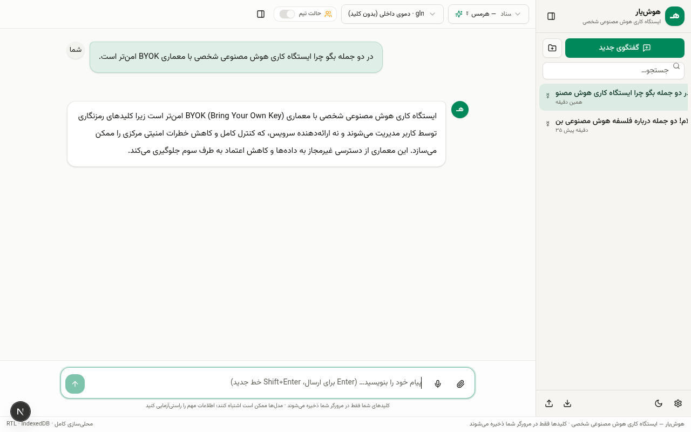
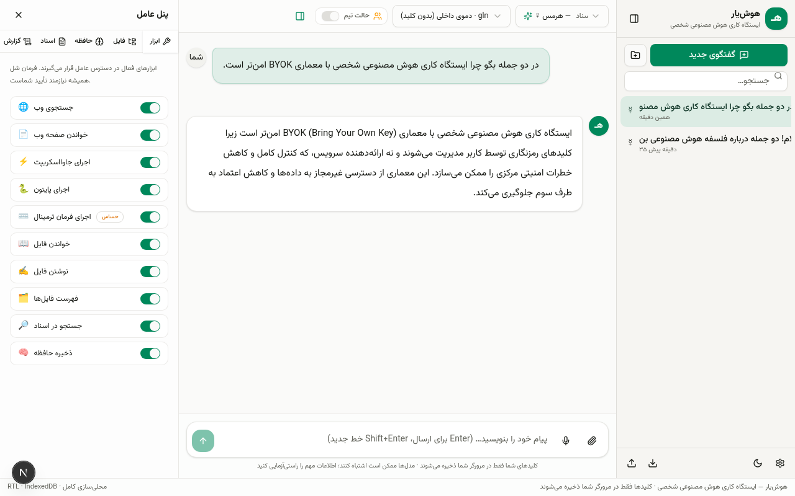
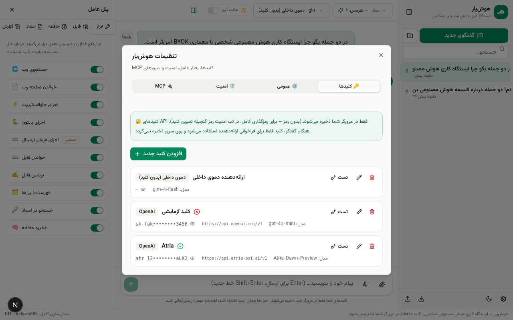
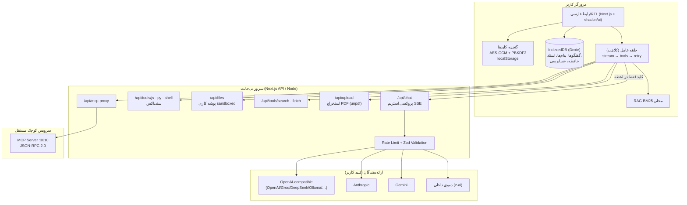

# 🪶 هوش‌یار — ایستگاه کاری هوش مصنوعی شخصی

<p align="center">
  
  
  
  
</p>

وب‌اپلیکیشن شخصی هوش مصنوعی با معماری **BYOK** (Bring Your Own Key): کلیدهای API خودتان را وارد می‌کنید و بلافاصله گفتگو، عامل هوشمند (Agent)، اجرای کد، جستجوی وب، بازیابی اسناد و ارکستراسیون چندعاملی در اختیار دارید. رابط کاربری کاملاً **فارسی و راست‌به‌چپ (RTL)** با فونت وزیرمتن.

> کلیدها فقط در مرورگر شما ذخیره می‌شوند (رمزگذاری AES-GCM). سرور هیچ کلیدی ذخیره نمی‌کند.

| گفتگو | پنل عامل | مدیریت کلیدها |
|---|---|---|
|  |  |  |

**شروع در ۳۰ ثانیه:** برنامه را باز کنید ← «استفاده از کلیدهای خودم» ← ارائه‌دهنده را انتخاب و کلید را بچسبانید ← «دریافت فهرست مدل‌ها» مدل مناسب را خودش انتخاب می‌کند ← چت کنید. 🚀

---

## ✨ امکانات

| دسته | امکانات |
|---|---|
| **ارائه‌دهندگان (BYOK)** | OpenAI، Anthropic (کلود)، Google Gemini، OpenRouter، Groq، DeepSeek، Mistral، Together، Fireworks، Ollama، LM Studio، هر نقطه پایانی سازگار با OpenAI + ارائه‌دهنده دموی داخلی بدون کلید |
| **گفتگو** | پاسخ استریمی (SSE)، مارک‌داون و هایلایت کد، کپی، ویرایش پیام، تولید دوباره، **انشعاب مکالمه (Branching)**، پیوست تصویر، خروجی/ورودی JSON، پوشه‌ها، برچسب، سنجاق، جستجو |
| **عامل هوشمند** | فراخوانی ابزار (Function Calling)، حلقه عامل چندگامی، تأیید انسانی برای اقدامات خطرناک (HITL)، پروفایل‌های شخصیت (هرمس، اوپن‌کد، پژوهشگر، تحلیل‌گر، ساده) |
| **ابزارها** | جستجوی وب، خواندن صفحه وب، اجرای JS سندباکس‌شده، اجرای پایتون، ترمینال شل سندباکس‌شده، خواندن/نوشتن/فهرست فایل در پوشه کاری، جستجو در اسناد، حافظه بلندمدت |
| **MCP** | کلاینت MCP (انتقال Streamable HTTP) + سرور MCP داخلی (`mini-services/mcp-server`، پورت 3010) |
| **RAG** | بارگذاری PDF/متن/کد → استخراج متن (سرور) → قطعه‌بندی و فهرست‌بندی **BM25 محلی در مرورگر** |
| **چندعاملی** | «حالت تیم»: برنامه‌ریز → مجری → منتقد (حداکثر ۲ دور بازنگری) |
| **صوت** | ورودی صوتی فارسی (Web Speech API) و پخش صوتی پاسخ (speechSynthesis) |
| **محلی‌سازی** | ۱۰۰٪ فارسی، RTL، اعداد و تاریخ شمسی (`Intl` fa-IR)، فونت وزیرمتن |

## 🏗 معماری



**چرا حلقه عامل سمت کلاینت است؟** سرور کاملاً بی‌حالت می‌ماند (هیچ گفتگویی ذخیره نمی‌شود)، تأیید انسانی به‌صورت طبیعی در UI حل می‌شود، و هر گام برای کاربر قابل مشاهده است.

## 🚀 اجرا (توسعه)

```bash
bun install
bun run dev        # http://localhost:3000
```

با npm هم می‌توانید:

```bash
npm install && npm run dev
```

سرویس MCP اختیاری:

```bash
cd mini-services/mcp-server && bun run dev   # پورت 3010
```

> 💡 **ارائه‌دهنده دمو (بدون کلید):** فقط روی میزبانیِ اصلی فعال است. روی هر میزبان دیگر، برنامه خودش با `/api/demo-status` تشخیص می‌دهد و دمو را با توضیح غیرفعال نشان می‌دهد — در آن صورت کافی است کلید خودتان را وارد کنید (BYOK).

## ☁️ استقرار روی GitHub

راهنمای گام‌به‌گام فارسی (ساخت مخزن، push، اتصال Vercel/Docker، به‌روزرسانی):
**[docs/GITHUB.md](docs/GITHUB.md)**

خلاصه:

```bash
git init && git add . && git commit -m "hooshiyar v1.0.0"
git remote add origin https://github.com/<USERNAME>/hooshiyar.git
git push -u origin main
```

سپس در Vercel/Netlify مخزن را Import کنید — متغیر محیطی خاصی لازم نیست (اپ BYOK است). کلید «Deploy to Vercel» هم در راهنما هست.

## 📦 استقرار

راهنمای کامل در [docs/DEPLOYMENT.md](docs/DEPLOYMENT.md) (Vercel، Netlify، Docker، سرور شخصی).

```bash
# Docker
docker build -t hooshiyar . && docker run -p 3000:3000 -v hooshiyar_ws:/app/workspace hooshiyar

# Docker Compose (اپ + سرور MCP)
docker compose --profile mcp up -d
```

⚠️ **نکته Vercel/Netlify:** ابزارهای شل/فایل/پایتون به فایل‌سیستم و پردازش فرزند نیاز دارند و در پلتفرم‌های Serverless کار نمی‌کنند؛ آنجا فقط گفتگو/جستجو/وب فعال است. برای امکانات کامل، self-host کنید.

## 🔐 امنیت

- **گنجینه کلیدها:** AES-GCM با کلید مشتق‌شده از PBKDF2-SHA256 (۲۵۰هزار تکرار، salt تصادفی ۱۶بایتی، IV تصادفی ۱۲بایتی). بدون تعیین رمز، فقط به‌صورت obfuscated ذخیره می‌شود (هشدار در تب امنیت).
- **کلید و سرور:** کلید فقط در بدنه درخواست لحظه‌ای به `/api/chat` می‌رسد و هیچ‌جا لاگ یا ذخیره نمی‌شود.
- **سندباکس شل:** پوشه کاری محدود، مسیرها sandboxed، فهرست ممنوع (sudo، rm -rf، mkfs، dd، pipe-to-sh…)، سقف زمان اجرا، و **تأیید انسانی الزامی** از UI.
- **سندباکس JS:** `node:vm` با گلوبال‌های منجمد (بدون require/process/fetch)، سقف زمان ۵ ثانیه.
- **سندباکس پایتون:** `python3 -I`، env تمیز، cwd پوشه کاری، مسدودسازی import های خطرناک، سقف زمان.
- **ورودی‌ها:** همه مسیرهای API با Zod اعتبارسنجی و با توکن‌باکتی محدودسازی نرخ می‌شوند.
- **حسابرسی:** اقدامات ابزار (شل، فایل، MCP، جستجو) در IndexedDB ثبت می‌شود (پنل عامل ← گزارش).
- **ایزوله‌سازی عملی:** برای ایزوله در سطح کانتینر، Docker deployment را با volume اختصاصی اجرا کنید (توضیح در DEPLOYMENT).

## 🧪 تست و صحت‌سنجی

صحت‌سنجی اجرایی انجام شده (Agent Browser + curl):

- ✅ استریم پاسخ (`/api/chat` + ارائه‌دهنده دمو) — برون‌سپاری SSE تأیید شد
- ✅ چت واقعی با endpoint سازگار با OpenAI (Atria) — استریم و پاسخ فارسی
- ✅ افزودن کلید **بدون دانستن نام مدل** — کشف خودکار مدل از `/models`
- ✅ پیام خطای اختصاصی برای محدودیت جغرافیایی ارائه‌دهنده (مثل ۴۰۳ OpenAI)
- ✅ جستجوی وب فارسی (`/api/tools/search`)
- ✅ سندباکس پایتون (خروجی فارسی، فاکتوریل)
- ✅ سندباکس JS (return سطح بالا + timeout)
- ✅ دروازه تأیید شل: بدون تأیید → 403، فرمان مخرب → مسدود
- ✅ نوشتن/خواندن فایل پوشه کاری (مسیر فارسی)
- ✅ MCP: initialize، tools/list، tools/call از طریق پروکسی
- ✅ ESLint بدون خطا + بارگذاری صفحه بدون خطای کنسول (Agent Browser)

**چک‌لیست تست دستی** (پس از افزودن کلید واقعی خودتان):

1. افزودن کلید در تنظیمات ← دکمه «تست» باید سبز شود.
2. گفتگوی ساده و مشاهده استریم + کپی/ویرایش/تولید دوباره/انشعاب.
3. فعال‌سازی «اوپن‌کد» و درخواست ساخت فایل ← تأیید شل/فایل در صورت درخواست.
4. بارگذاری PDF در تب اسناد ← پرسش از محتوای آن.
5. حالت تیم برای یک هدف چندمرحله‌ای.
6. خروجی JSON ← پاک‌سازی مرورگر ← بازیابی پشتیبان.

## 🧭 نقشه راه

- [ ] چرخش بار و fallback خودکار میان چند کلید هم‌ارائه‌دهنده (UI آماده است)
- [ ] Embedding اختیاری برای RAG برداری (در کنار BM25)
- [ ] اتصال واقعی WebContainer/Pyodide برای سندباکس تماماً سمت مرورگر
- [ ] استریم‌کردن reasoning مدل‌های متفکر در UI
- [ ] همگام‌سازی اختیاری چنددستگاهی با WebDAV/S3 خودکار
- [ ] پشتیبانی کامل MCP Resources/Prompts + SSE progress

## ⚠️ محدودیت‌های شناخته‌شده

1. **سندباکس‌ها ایزوله کامل نیستند** — `node:vm` و `python3` فرزند، هم‌کاربر اجرا می‌شوند؛ در محیط‌های چندکاربره از Docker/VM جدا استفاده کنید.
2. **سندباکس شل/فایل/پایتون در Vercel/Netlify کار نمی‌کند** (serverless بدون فایل‌سیستم ماندگار).
3. **RAG فعلی BM25 کلیدواژه‌ای است** — برای پرسش‌های معنایی پیچیده، embedding بهتر است (نقشه راه).
4. **ارائه‌دهنده دمو فقط روی میزبانی اصلی کار می‌کند** (pseudo-stream)؛ روی میزبان‌های دیگر به‌طور خودکار تشخیص و با پیام شفاف غیرفعال می‌شود — اپ BYOK است و با کلید شما کامل کار می‌کند.
5. برخی سرویس‌ها (مثل OpenAI) درخواست‌های بعضی مناطق را رد می‌کنند (خطای ۴۰۳ جغرافیایی)؛ در این حالت پیام خطا راهنمایی می‌کند که ارائه‌دهندهٔ دیگری انتخاب کنید یا از endpoint واسطه استفاده کنید.
6. **ورودی صوتی** به Web Speech API مرورگر وابسته است (کروم: بله؛ فایرفاکس: خیر).
7. **پیش‌فرض vault بدون رمز** برای شروع راحت است؛ حتماً در تب امنیت رمز تعیین کنید.

## 🗂 ساختار مخزن

```
src/
├── app/
│   ├── page.tsx                    # تنها صفحه (ورک‌اسپیس)
│   ├── layout.tsx                  # RTL + وزیرمتن + پوسته
│   ├── globals.css                 # تم زمردی + هایلایت کد
│   └── api/
│       ├── chat/                   # پروکسی استریم BYOK (SSE)
│       ├── providers/{test,models}/# اعتبارسنجی کلید و فهرست مدل‌ها
│       ├── tools/{search,fetch,js,py,shell}/
│       ├── files/                  # فایل‌سیستم سندباکس
│       ├── upload/                 # استخراج متن + PDF
│       └── mcp-proxy/              # پل JSON-RPC به سرورهای MCP
├── components/hooshiyar/
│   ├── workspace.tsx  sidebar.tsx  chat-view.tsx  message-item.tsx
│   ├── composer.tsx   streaming-bubble.tsx  markdown.tsx
│   ├── settings-dialog.tsx  agent-panel.tsx
│   ├── approval-dialog.tsx  onboarding.tsx  vault-unlock.tsx
│   └── store.ts  use-chat-session.ts
├── lib/
│   ├── types.ts                    # قراردادهای پیام/ابزار/استریم
│   ├── vault.ts                    # گنجینه AES-GCM
│   ├── idb.ts                      # Dexie/IndexedDB
│   ├── rag.ts                      # قطعه‌بندی + BM25 فارسی
│   ├── persian.ts                  # تاریخ/عدد فارسی
│   ├── providers/                  # registry + sse + adapters (openai/anthropic/gemini/demo)
│   └── agent/                      # tools, executor, loop, profiles, team
│   └── server/                     # ratelimit, workspace sandbox
└── components/ui/                  # shadcn/ui
mini-services/mcp-server/           # سرور MCP مستقل (پورت 3010)
workspace/                          # پوشه کاری سندباکس عامل
Dockerfile · docker-compose.yml · docs/DEPLOYMENT.md · .env.example
```

## 📄 مجوز

MIT — آزاد به استفاده، تغییر و توزیع. فونت وزیرمتن (OFL).

---

### English (summary)

**Hooshiyar** (Persian: « Wise Helper ») is a self-hostable, personal AI workspace with a **100% Persian RTL UI**. Bring your own API key (OpenAI, Anthropic, Gemini, OpenRouter, Groq, DeepSeek, Mistral, Together, Fireworks, Ollama, LM Studio, or any OpenAI-compatible endpoint) and instantly get: streaming chat with branching, an agentic tool loop (web search, code execution, shell, files) with human-in-the-loop approvals, MCP client/server, browser-side BM25 RAG for PDFs, long-term memory, and a planner/executor/critic multi-agent mode. Keys are AES-GCM encrypted in your browser only — the stateless server never stores them. Run locally with `bun install && bun run dev`, or deploy to Vercel/Netlify/Docker (system-level sandboxes need self-hosting; see [docs/DEPLOYMENT.md](docs/DEPLOYMENT.md)).
